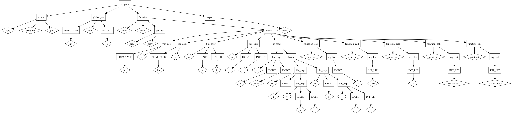

Canada Compiler
===============

Canada is a C-like language I made for fun to practice writing a compiler.

A sample program can be found in the file [factorial.ca](factorial.ca).
The abstract syntax tree for the file looks like:  

Status
------

Lexer: *done*  
Parser: *done*  
Code Generator: *done*

Dependencies
------------

* Python 3
* PLY (Python Lex/Yacc)
* NASM (for assembly)

TODO
----

* External functions
* Call C functions (stack alignment)

